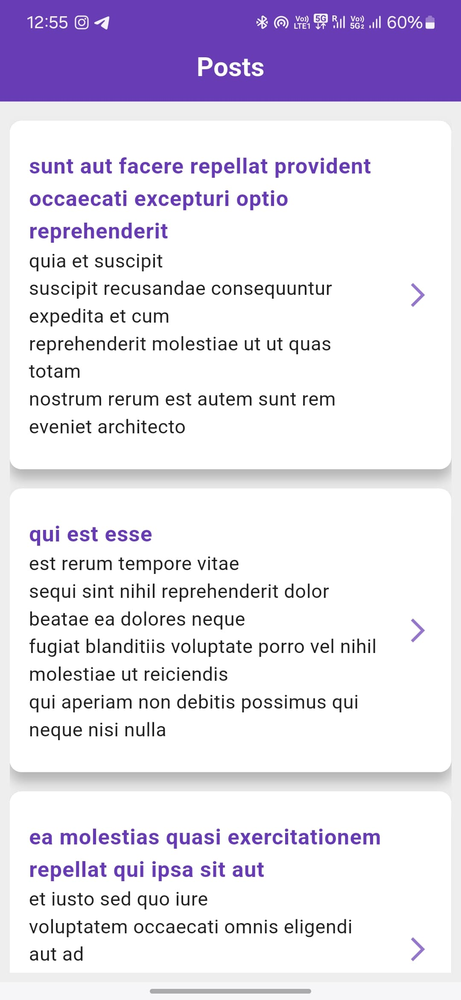

# 📱 Flutter Application

## 🚀 Overview
A brief description of your Flutter application, its purpose, and key features.

## ✨ Features
- ✅ [Feature 1]
- ✅ [Feature 2]
- ✅ [Feature 3]
- ✅ Responsive UI for mobile and laptop screens
- ✅ [Any other notable feature]

## 🛠️ Technologies Used
- 🎯 **Flutter**
- 🎯 **Dart**
- 🎯 [Additional dependencies or libraries used]

## 📥 Installation
Follow these steps to set up and run the application:

1. **Clone the repository:**
   ```bash
   git clone https://github.com/your-repo/flutter-app.git
   ```
2. **Navigate to the project directory:**
   ```bash
   cd flutter-app
   ```
3. **Install dependencies:**
   ```bash
   flutter pub get
   ```
4. **Run the application:**
   ```bash
   flutter run
   ```

## 📸 Screenshots
### 📱 Mobile Post_View

### 📱 Mobile Description_View
<src="Mobile_description_View.jpg" alt="Mobile Screenshot" width="300px"/>


### 💻 Laptop Post_View

### 💻 Laptop Description_View


## 🤝 Contribution
We welcome contributions! Follow these steps to contribute:

1. **Fork the repository.**
2. **Create a new branch:**
   ```bash
   git checkout -b feature-branch
   ```
3. **Make your changes and commit them:**
   ```bash
   git commit -m "Add new feature"
   ```
4. **Push to the branch:**
   ```bash
   git push origin feature-branch
   ```
5. **Open a Pull Request.**

## 📜 License
[Specify your license here, e.g., MIT License]

## 📞 Contact
For any queries, reach out to:
- **👤 Name:** Avinash Kushawaha
- **📧 Email:** [Your Email]
- **🔗 GitHub:** [Your GitHub Profile]
- **🔗 LinkedIn:** [Your LinkedIn Profile]

